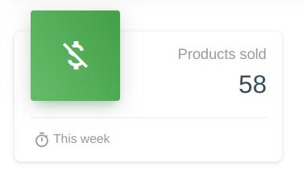

# Stats Card



A simple card showing a number.

## Sample
```php
use Sanjab\Cards\StatsCard;

$this->cards[] = StatsCard::create('Products')
    ->value(function () {
        return Product::count();
    });
```

## Properties

### footerTitle
`type: string`

A title in footer.

### footerIcon
`type: string`

Material icon in footer.

### link
`type: string`

Url of card

### value
`type: callable|mixed`

Value showing in card.

> Highly recommended to use callback instead of raw value inorder to prevent extra database queries.
```php
->value(function () {
    return Product::count();
})
```

### icon
`type: string`

Card icon

### variant
`type: string`

Card bootstrap variant (Examples: 'success', 'danger', ...).

