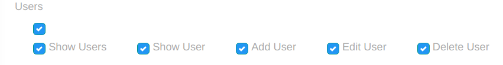

# Checkbox Group Widget


Group of checkboxes that storing as array.

## Sample
```php
use Sanjab\Widgets\CheckboxGroupWidget;

$this->widgets[] = CheckboxGroupWidget::create('abilities')
    ->addOption('share', 'Share')
    ->addOption('like', 'Like')
    ->addOption('comment', 'Comment');
```

You also should define `$casts` in you'r model.
```php
protected $casts = [
    'abilities' => 'array'
];
```
