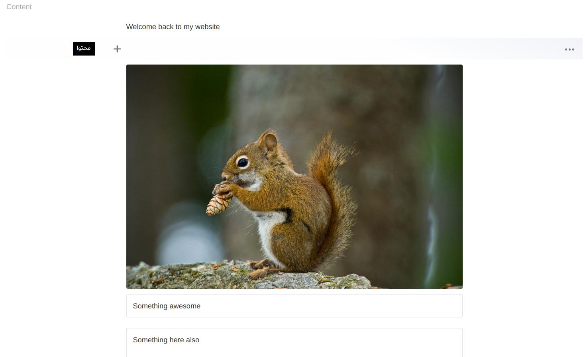

# Editor.js widget


An [Editor.js](https://github.com/codex-team/editor.js) wysiwyg input field.

## Sample
```php
use Sanjab\Widgets\Wysiwyg\EditorJsWidget;

$this->widgets[] = EditorJsWidget::create('content');
```

You also should define `$casts` in you'r model.
```php
protected $casts = [
    'content' => 'array'
];
```
